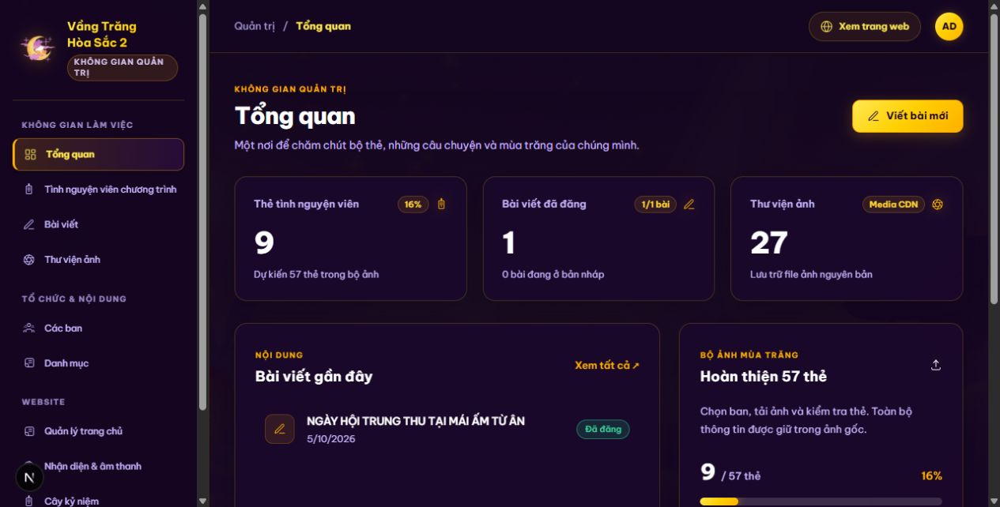
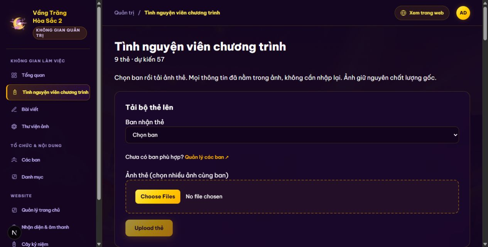
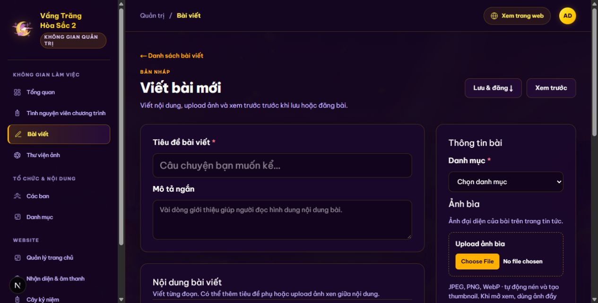
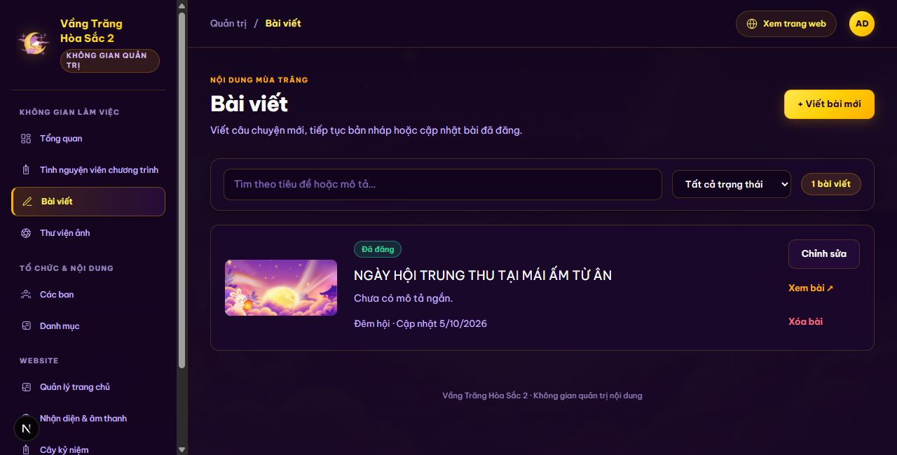
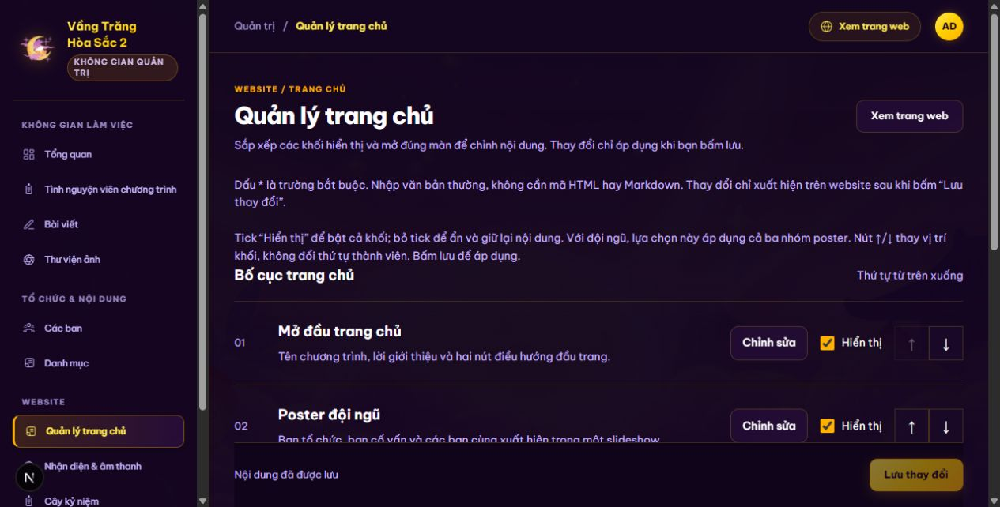
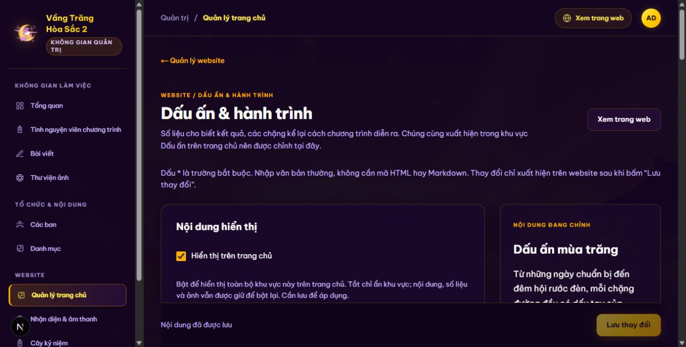
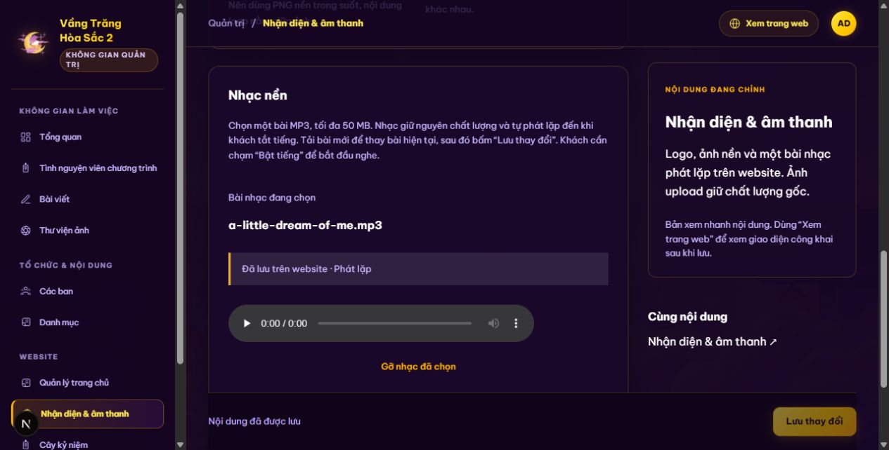
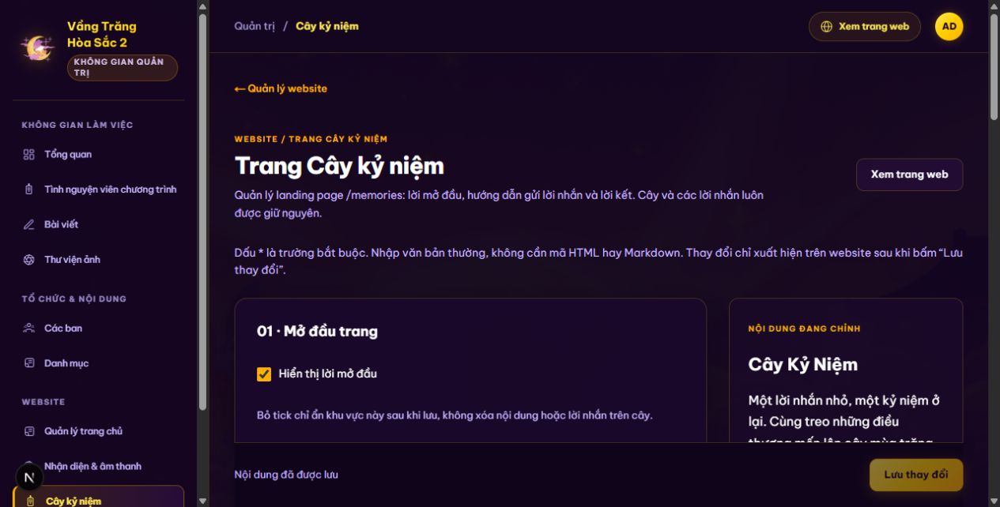

# Hướng dẫn quản trị Vầng Trăng Hòa Sắc 2

Cập nhật 05/10/2026. Tài liệu không chứa mật khẩu.

## Hướng dẫn quản trị website Vầng Trăng Hòa Sắc 2

Sổ tay dành cho Ban Tổ Chức và người được giao quản lý nội dung chương trình. Tài liệu giúp bạn đăng bài, quản lý ảnh thẻ, cập nhật trang chủ và thay nhạc nền mà không cần sửa mã nguồn.

### Thông tin sử dụng

Phiên bản 1.0 • Cập nhật ngày 05/10/2026 • Đối chiếu giao diện và mã nguồn tại bản 3d7c52c. Tên nút và ảnh chụp phản ánh phiên bản này; số lượng thẻ, bài viết và tên nội dung có thể thay đổi.

[Website công khai](https://vang-trang-hoa-sac-2.vercel.app/)

[Trang quản trị](https://vang-trang-hoa-sac-2.vercel.app/admin)

### Cách đọc tài liệu

Trang 2 là hướng dẫn nhanh cho ba việc thường dùng. Trang 3 giúp chọn đúng màn quản trị. Từ trang 4 đến 16 là các thao tác chi tiết; trang 17 và 18 dùng khi gặp lỗi hoặc bàn giao cho người khác.

Các ví dụ nhập liệu chỉ dùng để minh họa. Kiểm tra thông tin thực tế trước khi đăng. Tài liệu không ghi mật khẩu; sử dụng thông tin đăng nhập được BTC bàn giao riêng.

## Hướng dẫn nhanh cho ba việc thường dùng

### Đăng một bài viết

1. Vào Bài viết, bấm “+ Viết bài mới”. Nhập tiêu đề và chọn danh mục.
2. Viết nội dung, upload ảnh bìa. Có thể thêm ảnh trong bài hoặc bộ ảnh cuối bài; album không bắt buộc.
3. Bấm “Xem trước”, kiểm tra chính tả và ảnh. Bấm “Lưu bản nháp” để làm tiếp hoặc “Đăng bài” để công khai.
4. Mở bài công khai, kiểm tra trên điện thoại. Nếu đang sửa bài đã đăng, bấm “Cập nhật bài đã đăng”.

### Upload thẻ thành viên theo ban

1. Vào Tình nguyện viên chương trình, chọn “Ban nhận thẻ”.
2. Chọn nhiều ảnh hoàn chỉnh của cùng ban. Tick “Trưởng BTC / ban” hoặc “Phó BTC / ban” cho đúng từng ảnh; không tick là thành viên.
3. Bấm “Upload … thẻ”, đợi thông báo kết quả. Chỉ tải lại những ảnh thất bại.
4. Mở trang chủ và lọc theo ban để kiểm tra ảnh, vai trò và thứ tự.

### Thay nhạc nền

1. Vào Nhận diện & âm thanh, tìm phần “Nhạc nền”. Chọn một tệp MP3.
2. Đợi hiện tên file và dòng “Đã tải lên · Chưa lưu trên website”.
3. Bấm “Lưu thay đổi”. Đợi “Đã lưu trên website · Phát lặp”; tải lại admin để xác nhận.
4. Bấm “Xem trang web”, rồi “Bật tiếng” trên web công khai. Nhạc sẽ phát lặp đến khi tắt tiếng.

Ghi nhớ: upload xong chưa có nghĩa là nội dung website hoặc bài viết đã được lưu. Riêng upload thẻ thành công sẽ tạo thẻ ngay; không có nút lưu bổ sung.

## Đăng nhập và chọn đúng màn quản trị

**Mở màn hình:** `/admin`

1. Mở địa chỉ trang quản trị, nhập email quản trị và mật khẩu được bàn giao, bấm “Đăng nhập”.
2. Chọn màn cần dùng trong sidebar. Trên màn hình nhỏ, bấm nút mở điều hướng để xem menu.
3. Bấm “Xem trang web” ở thanh trên cùng để mở trang công khai trong tab mới và giữ nguyên admin.
4. Khi làm xong, bấm “Đăng xuất”, đặc biệt trên máy dùng chung.

| Bạn muốn làm gì | Mục cần mở |
| --- | --- |
| Xem tình hình nội dung | Tổng quan |
| Upload và phân ban ảnh thẻ | Tình nguyện viên chương trình |
| Viết hoặc cập nhật tin tức | Bài viết |
| Upload và quản lý ảnh gốc | Thư viện ảnh |
| Tạo ban hoặc danh mục | Các ban / Danh mục |
| Đổi bố cục hoặc lời giới thiệu | Quản lý trang chủ |
| Thay logo nền và MP3 | Nhận diện & âm thanh |
| Chỉnh lời dẫn trang lời nhắn | Cây kỷ niệm |

## Tạo sửa và xóa các ban

**Mở màn hình:** `/admin/departments`

Tạo ban trước khi upload thẻ để chọn đúng nơi nhận ảnh. Ban tổ chức và ban cố vấn cũng dùng bộ thẻ tình nguyện viên như các ban khác.

1. Mở “Các ban”, dùng nút thêm mới trong màn danh sách.
2. Nhập tên ban. Điền mã ban, mô tả, trạng thái hiển thị và thứ tự nếu cần.
3. Bấm “Lưu thay đổi”, kiểm tra tên ban xuất hiện trong danh sách và trong ô “Ban nhận thẻ”.
4. Muốn sửa, tìm ban rồi bấm “Sửa”. Có thể đổi tên, mô tả, thứ tự hoặc bỏ tick hiển thị.

| Trường | Cách nhập |
| --- | --- |
| Tên | Bắt buộc; ví dụ Ban Hậu Cần. Tối đa 160 ký tự. |
| Mã ban | Tùy chọn; dùng mã ngắn dễ nhận biết, tối đa 40 ký tự. |
| Mô tả | Tùy chọn; văn bản thường, tối đa 2.000 ký tự. |
| Hiển thị | Tick để công khai ban. Bỏ tick để ẩn và giữ dữ liệu. |
| Thứ tự | Số nguyên từ 0 đến 100.000. Số nhỏ được xếp trước trong nhóm tương ứng. |

### Xóa ban đang có dữ liệu

1. Bấm “Xóa” ở đúng ban. Đọc nội dung cửa sổ xác nhận.
2. Nếu ban có thẻ hoặc nhân sự liên kết, chọn một ban khác ở ô “Chuyển thẻ và nhân sự sang ban”.
3. Bấm “Xác nhận xóa”. Dữ liệu được chuyển sang ban đã chọn; ban cũ bị xóa.

Kiểm tra: mở bộ thẻ và lọc theo ban nhận dữ liệu. Không cần chọn nơi chuyển nếu ban chưa có dữ liệu. Muốn tạm ngừng hiển thị thì nên ẩn ban thay vì xóa.

## Tạo sửa và xóa danh mục bài viết

**Mở màn hình:** `/admin/categories`

Danh mục giúp người đọc lọc bài theo chủ đề. Chuẩn bị danh mục trước khi viết bài; mỗi bài cần chọn một danh mục để lưu.

1. Mở “Danh mục”, dùng nút thêm mới.
2. Nhập tên ngắn dễ hiểu, ví dụ Hoạt động hoặc Khoảnh khắc. Nhập thứ tự nếu cần.
3. Bấm “Lưu thay đổi”. Vào trình soạn bài để kiểm tra danh mục trong ô lựa chọn.
4. Để sửa, tìm danh mục, bấm “Sửa”, cập nhật rồi lưu.

| Trường | Cách nhập |
| --- | --- |
| Tên | Bắt buộc; tối đa 80 ký tự. Không đặt tên là Tất cả vì website dùng tên này cho bộ lọc chung. |
| Thứ tự | Số nguyên từ 0 đến 100.000; số nhỏ được xếp trước. |

### Xóa danh mục

1. Bấm “Xóa” ở danh mục cần bỏ.
2. Nếu đã có bài thuộc danh mục, chọn danh mục khác trong ô “Chuyển bài viết sang danh mục”.
3. Bấm “Xác nhận xóa”. Mở lại bài để kiểm tra danh mục mới.

Danh mục trống có thể xóa mà không cần nơi chuyển. Nếu bị chặn xóa do có bài liên kết, hãy chọn nơi chuyển hoặc sửa từng bài trước. Không xóa bài chỉ để xóa danh mục.

### Gợi ý tổ chức nội dung

Dùng các chủ đề mà BTC thực sự cần phân loại. Giữ tên nhất quán, tránh nhiều danh mục gần nghĩa. Ô tìm kiếm ở danh sách giúp tìm mục cần sửa nhanh hơn.

## Upload bộ thẻ tình nguyện viên

**Mở màn hình:** `/admin/volunteers`

1. Chọn “Ban nhận thẻ”, sau đó chọn một hoặc nhiều ảnh của cùng ban.
2. Đánh dấu từng ảnh là “Trưởng BTC / ban” hoặc “Phó BTC / ban” nếu phù hợp. Hai lựa chọn loại trừ nhau; không tick là thành viên.
3. Bấm “Upload … thẻ”. Đợi kết quả từng file; không rời màn khi đang tải.
4. Kiểm tra tổng số thẻ và thông báo kết quả. Ảnh thất bại còn trong danh sách chọn để thử lại.

Ảnh cần có sẵn tên, MSSV, ban và chức vụ; không nhập lại những thông tin này lên web. Dùng JPEG, PNG hoặc WebP, tối đa 10 MB mỗi ảnh. Ảnh giữ nguyên chất lượng gốc. 57 là số thẻ dự kiến, không phải số lượng bắt buộc để hiển thị.

Kiểm tra: mở trang chủ, chọn đúng ban, bảo đảm ảnh đầy đủ và đúng người. Không upload lại cả bộ khi một vài file lỗi để tránh trùng thẻ.

## Chỉnh vai trò thứ tự và trạng thái thẻ

**Mở màn hình:** `/admin/volunteers`

Những thay đổi trên thẻ đã upload được lưu ngay khi thao tác thành công. Bạn không cần bấm nút lưu riêng ở cuối màn này.

1. Chọn “Lọc theo ban” để tìm nhóm cần sửa. Bấm “Tải lại danh sách” nếu vừa được người khác cập nhật.
2. Trên thẻ, chọn lại “Ban” để chuyển thẻ sang ban khác.
3. Tick trưởng hoặc phó ban; bỏ tick cả hai để trở về thành viên. Đợi thông báo “Đã cập nhật thẻ”.
4. Sửa số trong ô “Thứ tự”, rồi bấm ra ngoài ô để lưu. Tick hoặc bỏ tick “Hiện thẻ trên trang chủ” để hiện hoặc ẩn thẻ.

### Quy tắc sắp xếp trên web

- Ban tổ chức xuất hiện trước, tiếp theo là ban cố vấn, sau đó đến các ban khác.
- Trong mỗi ban: trưởng ban trước, phó ban tiếp theo, thành viên sau cùng.
- Ô “Thứ tự” sắp xếp các thẻ cùng mức vai trò. Không dùng số thứ tự để đẩy thành viên vượt lên trước trưởng hoặc phó ban.

### Xóa hoặc thay ảnh thẻ

1. Muốn gỡ thẻ khỏi chương trình, bấm “Xóa thẻ” rồi “Xác nhận xóa”. Ảnh vẫn còn trong Thư viện ảnh.
2. Hiện chưa có ô thay file trên thẻ cũ. Để dùng ảnh sửa nội dung, upload ảnh mới vào đúng ban và vai trò, kiểm tra rồi gỡ thẻ cũ.

Kiểm tra: chọn Tất cả tình nguyện viên và từng ban trên trang chủ. Nếu sai thông tin nằm bên trong ảnh, phải sửa ảnh gốc rồi upload lại; đổi ban trên admin không sửa chữ trong ảnh.

## Viết nội dung bài mới

**Mở màn hình:** `/admin/posts/new`

1. Nhập “Tiêu đề bài viết” và chọn “Danh mục”. Mô tả ngắn là lời giới thiệu, không thay cho nội dung chính.
2. Dùng “+ Đoạn văn” để viết từng đoạn; “+ Tiêu đề phụ” để chia các phần; “+ Danh sách” để nhập mỗi ý trên một dòng.
3. Dùng nút đưa mục lên hoặc xuống để đổi thứ tự. “Gỡ” chỉ bỏ khối khỏi bài đang chỉnh.
4. Bấm “Xem trước” để kiểm tra trình bày; thao tác này chưa lưu hay đăng bài.

Tiêu đề tối đa 160 ký tự; mô tả ngắn tối đa 2.000 ký tự. Nhập văn bản thường, không cần HTML hay dấu Markdown. Dùng nhiều khối Đoạn văn khi muốn tách ý rõ ràng.

Ví dụ minh họa: tiêu đề “Nhìn lại đêm hội Trung Thu”, mô tả ngắn giới thiệu bối cảnh, sau đó các tiêu đề phụ như Chuẩn bị và Những khoảnh khắc đáng nhớ. Chỉ dùng thông tin BTC đã xác nhận.

## Upload ảnh bìa ảnh trong bài và album

**Mở màn hình:** `/admin/posts/new`

Ảnh trong bài được upload từ máy ngay trong trình soạn. Bạn không cần chọn từ một danh sách ảnh có sẵn.

| Vị trí ảnh | Cách dùng |
| --- | --- |
| Ảnh bìa | Upload một ảnh đại diện ở phần Thông tin bài. Bắt buộc khi đăng công khai. |
| Ảnh trong nội dung | Bấm “+ Upload ảnh vào nội dung”. Có thể chọn nhiều ảnh; mỗi ảnh tạo một khối. |
| Bộ ảnh cuối bài | Bấm “Upload bộ ảnh cuối bài” để tạo album. Không bắt buộc khi đăng. |

1. Chọn file JPEG, PNG hoặc WebP. Giới hạn hiện tại là 50 MB mỗi ảnh bài viết.
2. Đợi upload hoàn tất. Hệ thống tự nén ảnh và tạo thumbnail để tiết kiệm dung lượng.
3. Nhập chú thích nếu muốn. Sắp xếp ảnh bằng nút lên xuống, hoặc “Gỡ ảnh” khỏi bài.
4. Bấm lưu nháp hoặc đăng/cập nhật bài để giữ liên kết ảnh trong bài viết.

Ảnh bài viết được chuyển sang WebP; ảnh đầy đủ giữ độ phân giải, thumbnail nhẹ hơn để tải nhanh. Chất lượng nén không đồng nghĩa với giữ nguyên từng byte của file gốc. Thẻ, poster, logo và ảnh nền dùng luồng ảnh gốc riêng.

### Kiểm tra trước khi đăng

- Ảnh bìa đúng hoạt động, không lấy ảnh của chương trình khác.
- Chú thích không sai tên người hoặc thời gian.
- Không có ảnh trùng hoặc ảnh upload lỗi.
- Ảnh công khai hiển thị theo tỷ lệ; chạm ảnh không mở popup phóng ảnh.

## Lưu nháp đăng cập nhật và xóa bài

**Mở màn hình:** `/admin/posts`

1. “Lưu bản nháp”: cần tiêu đề và danh mục; bài chỉ quản trị viên thấy. Có thể tiếp tục qua “Chỉnh sửa”.
2. “Đăng bài”: cần tiêu đề, danh mục, ảnh bìa và ít nhất một khối nội dung có thông tin. Album không bắt buộc.
3. Sửa bài đang công khai rồi bấm “Cập nhật bài đã đăng”. Muốn tạm gỡ khỏi web, bấm “Chuyển về bản nháp”.
4. Tìm bài bằng tiêu đề hoặc mô tả, lọc Bản nháp / Đã đăng để kiểm tra trạng thái.
5. Bấm “Xóa bài” rồi “Xác nhận xóa” để xóa hẳn bài. Ảnh của bài vẫn được giữ trong Thư viện ảnh.

Kiểm tra: dùng “Xem bài” hoặc “Mở bài công khai” để xem đúng bài trong tab mới. Tải lại danh sách admin để xác nhận trạng thái. Không xem “Xem trước” là bằng chứng đã đăng thành công.

Rời trình soạn khi chưa lưu có thể làm mất phần vừa nhập. Nếu xuất hiện cảnh báo, ở lại và lưu trước; chỉ bỏ thay đổi khi bạn thực sự không cần giữ chúng.

## Quản lý thư viện ảnh

**Mở màn hình:** `/admin?section=assets`

Thư viện ảnh tập hợp file ảnh đã upload. Bạn mở màn này từ sidebar, kể cả khi địa chỉ vẫn thuộc /admin.

1. Mở “Thư viện ảnh”. Dùng ô tìm kiếm để tìm theo tên file hoặc mô tả.
2. Ở phần tải ảnh gốc, chọn JPEG, PNG hoặc WebP, tối đa 10 MB. Ảnh được upload và lưu ngay vào thư viện.
3. Bấm “Sửa” ở một ảnh để cập nhật mô tả, rồi “Lưu thay đổi”. Mô tả giúp nhận biết ảnh và hỗ trợ khả năng tiếp cận.
4. Chỉ bấm “Xóa” khi ảnh không còn được sử dụng. Đọc thông báo rồi “Xác nhận xóa”.

### Khi ảnh đang được sử dụng

Hệ thống chặn xóa ảnh đang liên kết với thẻ, bài viết, poster hoặc nhận diện. Gỡ hoặc thay ảnh tại nơi sử dụng trước, lưu thay đổi rồi quay lại thư viện để xóa. Ẩn một khu vực không có nghĩa là đã gỡ liên kết ảnh.

| Bạn vừa làm gì | Ảnh trong thư viện |
| --- | --- |
| Xóa bài viết | Vẫn giữ lại ảnh của bài. |
| Xóa thẻ tình nguyện viên | Vẫn giữ lại file ảnh thẻ. |
| Gỡ một ảnh trong trình soạn | Bỏ khỏi bài sau khi lưu; file vẫn còn trong thư viện. |
| Xóa file ảnh ở thư viện | Xóa file không còn sử dụng; không có nút khôi phục trong admin. |

Nhạc MP3 được quản lý tại Nhận diện & âm thanh, không nằm trong danh sách ảnh. Khi cần thay nội dung bên trong ảnh, sửa file trên máy rồi upload bản mới.

## Sắp xếp và bật tắt bố cục trang chủ

**Mở màn hình:** `/admin/website`

1. Mở “Quản lý trang chủ”. Danh sách thể hiện thứ tự các khối từ trên xuống.
2. Dùng nút lên xuống để đổi vị trí cả khối. Tick “Hiển thị” để bật, bỏ tick để ẩn.
3. Bấm “Chỉnh sửa” ở khối cần cập nhật để mở màn riêng. Nếu bố cục đang có thay đổi, lưu trước khi rời màn.
4. Bấm “Lưu thay đổi” sau khi sắp xếp hoặc bật/tắt. Mở web trong tab mới để kiểm tra.

Poster đội ngũ là một khối slideshow gồm BTC, cố vấn và các ban. Đổi vị trí khối không đổi thứ tự thẻ thành viên. Tắt hiển thị chỉ ẩn khối, giữ nguyên nội dung để bật lại sau.

Logo, ảnh nền, nhạc và trang Cây kỷ niệm có màn chỉnh riêng. Không cần thêm chúng vào thứ tự các khối trang chủ.

## Chỉnh phần mở đầu poster bộ thẻ và chân trang

| Màn chỉnh | Nội dung và cách dùng |
| --- | --- |
| Mở đầu trang chủ
/admin/website/hero | Sửa tên chương trình, dòng dẫn, giới thiệu và tên hai nút. Chỉ nhập chữ cho nút; đường dẫn đã được thiết lập. |
| Poster đội ngũ
/admin/website/team | Bật/tắt riêng BTC, cố vấn và các ban. Chọn ảnh trong thư viện hoặc upload một poster thay thế cho cả nhóm. Dùng mặc định để trở về bộ poster có sẵn. |
| Thẻ tình nguyện viên
/admin/website/volunteers | Chỉ sửa tiêu đề và lời dẫn phía trên bộ thẻ. Upload ảnh và phân vai trò ở Tình nguyện viên chương trình. |
| Chân trang
/admin/website/footer | Sửa tên ở dòng bản quyền, lời cảm ơn và câu kết nổi bật. Hệ thống tự thêm năm vào dòng bản quyền. |

1. Mở màn tương ứng từ “Chỉnh sửa” ở bố cục trang chủ.
2. Đọc ghi chú dưới từng trường và sửa nội dung bằng văn bản thường. Dấu * là trường bắt buộc.
3. Nếu thay ảnh, đợi upload hoàn tất rồi bấm “Lưu thay đổi”.
4. Mở trang chủ, cuộn tới đúng khối và kiểm tra nội dung trên cả máy tính lẫn điện thoại.

Poster cần là ảnh hoàn chỉnh có sẵn thông tin đội ngũ, tối đa 10 MB. Chọn một ảnh thay thế sẽ thay cả nhóm bằng một poster, không thêm ảnh đó vào giữa bộ mặc định. Trên điện thoại, vuốt để chuyển poster; chú thích và chấm chọn được ẩn.

## Cập nhật số liệu và các chặng hành trình

**Mở màn hình:** `/admin/website/recap`

1. Chỉnh tiêu đề, lời giới thiệu và trạng thái hiển thị của khu vực nếu cần.
2. Ở “Số liệu chương trình”, bấm “Thêm số liệu”. Nhập “Tên số liệu” và “Giá trị”; dùng “Gỡ số liệu” để bỏ một mục.
3. Ở “Các chặng hành trình”, bấm “Thêm chặng”, mở từng chặng và nhập tên giai đoạn, tiêu đề, thời gian, câu chuyện, điểm nhấn.
4. Dùng nút lên xuống để sắp xếp chặng, “Gỡ” để bỏ chặng. Bấm “Lưu thay đổi”.

Chỉ nhập số liệu đã xác nhận. Giá trị có thể là “65” hoặc “100+”; để trống thì chỉ số không xuất hiện. Tên số liệu bắt buộc. Tối đa 12 mục; các mục đang hiển thị được căn giữa.

Tên giai đoạn và tiêu đề chặng bắt buộc. Thời gian có thể nhập DD/MM/YYYY hoặc chữ; hệ thống không tự chuyển định dạng. Trong Câu chuyện, Enter xuống dòng, Enter hai lần tách đoạn. Tối đa 2.000 ký tự cho câu chuyện; điểm nhấn là tùy chọn.

## Thay logo ảnh nền và nhạc chương trình

**Mở màn hình:** `/admin/website/brand`

1. Logo và ảnh nền: chọn ảnh thư viện hoặc upload JPEG, PNG, WebP tối đa 10 MB. Chọn mặc định để trở về ảnh có sẵn.
2. Nhạc nền: chọn một MP3 tối đa 50 MB. Tên file hiện ngay lúc upload; đợi “Đã tải lên · Chưa lưu trên website”.
3. Nghe thử nếu cần, sau đó bấm “Lưu thay đổi”. Đợi trạng thái “Đã lưu trên website · Phát lặp”.
4. Tải lại admin để kiểm tra tên bài còn đúng. Mở web, bấm “Bật tiếng” để nghe bài đã lưu.

Chỉ một bài được chọn. Muốn đổi bài, upload MP3 mới rồi lưu; muốn gỡ, bấm “Gỡ nhạc đã chọn” rồi lưu. Khi chưa chọn MP3, web dùng giai điệu chuông mặc định. Nhạc phát lặp; cần thao tác bật tiếng đầu tiên, và sẽ dừng khi ẩn tab hoặc vào admin.

Logo nên có nền trong suốt và nội dung ở giữa. Ảnh nền nên ngang, độ phân giải cao; phần sát mép có thể nằm ngoài khung trên một số thiết bị.

## Chỉnh trang Cây kỷ niệm

**Mở màn hình:** `/admin/website/memories`

1. Phần mở đầu: sửa tên trang, dòng dẫn và giới thiệu; bật/tắt lời mở đầu bằng checkbox.
2. Phần hướng dẫn: sửa tiêu đề và cách gửi lời nhắn. Bật/tắt phần này nếu cần.
3. Phần lời kết: sửa lời cảm ơn cuối trang; để trống để không có lời kết hoặc bỏ tick hiển thị.
4. Bấm “Lưu thay đổi”, mở /memories để kiểm tra. Logo và nền dùng chung cấu hình Nhận diện & âm thanh.

Các checkbox chỉ ẩn phần giới thiệu tương ứng, không xóa cây hoặc lời nhắn. Khách điền tên, ban nếu muốn, nội dung tối đa 1.000 ký tự và chọn lồng đèn/ngôi sao để gửi. Chạm vào kỷ niệm trên cây để đọc.

Trên điện thoại, danh sách “Lời nhắn của chúng ta” được ẩn; cây và biểu mẫu gửi vẫn dùng được. Menu admin hiện không có màn duyệt, sửa hoặc xóa lời nhắn. Nếu cần xử lý một lời nhắn, chuyển yêu cầu cho người phụ trách kỹ thuật.

## Xử lý lỗi thường gặp

| Dấu hiệu | Việc cần làm |
| --- | --- |
| Không đăng nhập được | Kiểm tra email và mật khẩu được bàn giao. Tài khoản cần có quyền quản trị; liên hệ người phụ trách nếu vẫn bị từ chối. |
| Không thấy thay đổi trên web | Xác định màn có cần lưu hay không. Bài phải ở trạng thái Đã đăng; khối và ban/thẻ cần được bật. Mở đúng trang rồi tải lại. |
| Không đăng được bài | Kiểm tra tiêu đề, danh mục, ảnh bìa và nội dung. Không cần album. Đọc thông báo lỗi ngay trong trình soạn. |
| Upload ảnh thất bại | Kiểm tra định dạng và dung lượng ở trang 18, kết nối mạng, rồi thử lại file lỗi. Không chỉ đổi đuôi tệp để chuyển định dạng. |
| Upload nhạc nhưng chưa nghe được | Chờ tải xong, bấm Lưu thay đổi, xác nhận tên file và Đã lưu trên website. Mở web và bấm Bật tiếng; kiểm tra âm lượng thiết bị. |
| Một vài thẻ không upload được | Đọc kết quả từng file. Chỉ thử lại file lỗi; kiểm tra thư viện nếu có thông báo ảnh chưa liên kết. |
| Thẻ xuất hiện sai ban hoặc sai thứ tự | Đổi Ban và trưởng/phó/thành viên trong màn thẻ. Thứ tự chỉ áp dụng trong cùng mức vai trò. |
| Không xóa được ảnh | Ảnh đang được sử dụng. Gỡ/thay ảnh ở nơi liên kết, lưu rồi quay lại thư viện. |
| Không xóa được ban hoặc danh mục | Chọn ban/danh mục nhận dữ liệu trong cửa sổ xác nhận. |
| Phiên đăng nhập hết hạn hoặc lỗi kết nối | Giữ bản nội dung đang viết ở nơi khác, thử lại hoặc đăng nhập lại khi được yêu cầu. Không mặc định rằng thay đổi đã lưu. |

Khi báo lỗi, gửi tên màn, thao tác vừa làm, thông báo lỗi, tên file và dung lượng nếu liên quan upload, cùng ảnh màn hình. Không gửi mật khẩu trong ảnh hoặc nội dung báo lỗi.

## Giới hạn nhập liệu và kiểm tra bàn giao

| Loại dữ liệu | Định dạng và giới hạn hiện tại |
| --- | --- |
| Ảnh thẻ poster logo nền thư viện | JPEG / PNG / WebP; tối đa 10 MB mỗi ảnh; giữ file gốc. |
| Ảnh bài viết | JPEG / PNG / WebP; tối đa 50 MB mỗi ảnh; tự nén WebP và tạo thumbnail. |
| Nhạc nền | MP3; tối đa 50 MB; chọn một bài và phát lặp. |
| Bài viết | Tiêu đề 160 ký tự; mô tả ngắn 2.000; tối đa 500 khối nội dung và 200 ảnh album. |
| Dấu ấn và hành trình | Tối đa 12 số liệu và 100 chặng; giá trị số liệu 80 ký tự, tên 160. |
| Lời nhắn của khách | Tên tối đa 80 ký tự, ban tối đa 80, nội dung tối đa 1.000. |

### Checklist trước khi gửi web cho người xem

- Bài cần công khai đã ở trạng thái Đã đăng, ảnh và chú thích đúng.
- Thẻ được phân đúng ban, vai trò và không bị trùng; số lượng được BTC đối chiếu.
- Số liệu, thời gian và tên trong poster đã được xác nhận.
- Các khối cần hiện được bật; nội dung vẫn dễ đọc trên điện thoại.
- Nhạc đã hiện tên file và trạng thái đã lưu; thử Bật tiếng một lần.
- Trang Cây kỷ niệm có hướng dẫn đúng và khách đọc được lời nhắn trên cây.

### Bàn giao cho người quản lý tiếp theo

Gửi tài liệu này, đường dẫn web và danh sách nội dung cần cập nhật. Bàn giao thông tin đăng nhập riêng; lưu bản gốc ảnh và bài viết của CLB. Admin không có nút hoàn tác sau khi xóa; ưu tiên ẩn thẻ/khu vực hoặc chuyển bài về nháp khi chỉ muốn tạm ngừng hiển thị.

Nguồn đối chiếu: các màn admin và quy tắc nhập liệu của dự án, bản 3d7c52c. Sau khi chức năng hoặc tên nút thay đổi, cập nhật bản Markdown và xuất lại Word/PDF trước khi bàn giao.
